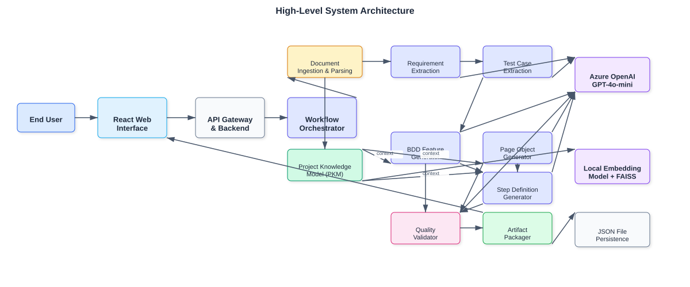
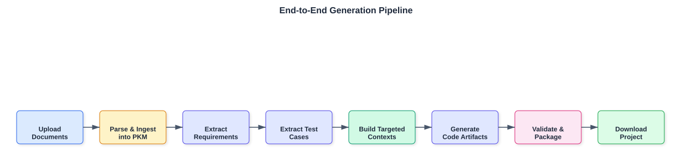
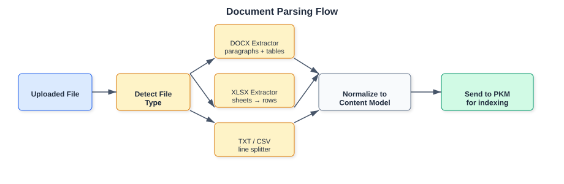
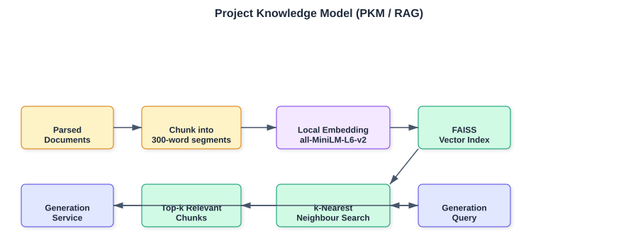
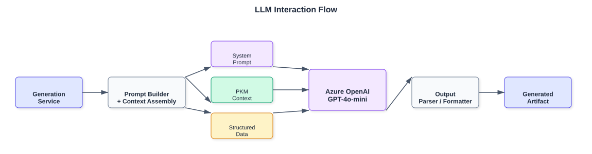
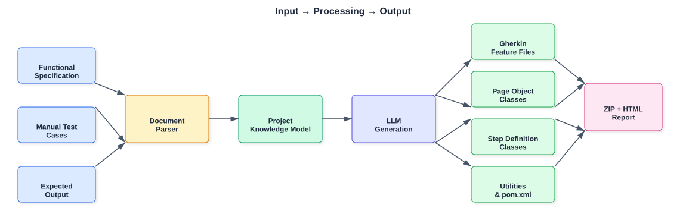
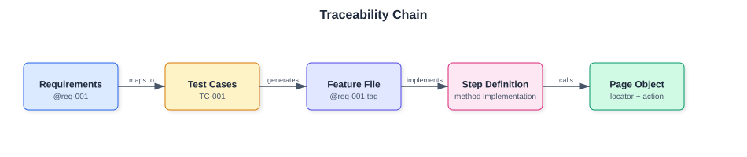
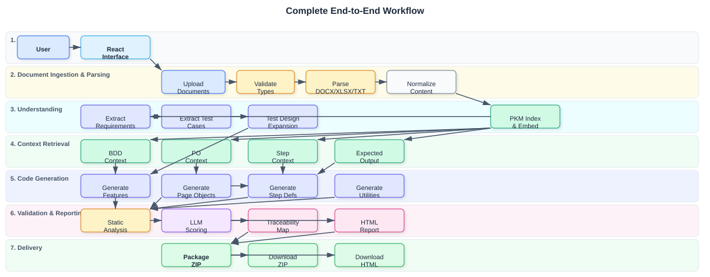

# QA Agent v2 — Architecture Overview

> **Client-Facing Architecture Documentation**  
> Last updated: July 2026

---

## Table of Contents

1. [Project Overview](#1-project-overview)
2. [Architecture Principles](#2-architecture-principles)
3. [System Architecture](#3-system-architecture)
4. [End-to-End Generation Pipeline](#4-end-to-end-generation-pipeline)
5. [Inputs](#5-inputs)
6. [Document Parsing](#6-document-parsing)
7. [Project Knowledge Model (PKM)](#7-project-knowledge-model-pkm)
8. [LLM Interaction Flow](#8-llm-interaction-flow)
9. [Component Responsibilities](#9-component-responsibilities)
10. [Data Flow](#10-data-flow)
11. [Generated Outputs](#11-generated-outputs)
12. [Traceability](#12-traceability)
13. [Quality Validation](#13-quality-validation)
14. [HTML Report Generation](#14-html-report-generation)
15. [Packaging & Downloadable Artifacts](#15-packaging--downloadable-artifacts)
16. [Current Capabilities](#16-current-capabilities)
17. [Current Limitations](#17-current-limitations)
18. [Future Enhancements](#18-future-enhancements)
19. [Complete End-to-End Workflow Architecture](#19-complete-end-to-end-workflow-architecture)

---

## 1. Project Overview

**QA Agent v2** is an intelligent, web-based automation engineering platform that transforms unstructured QA documents into a **production-ready Java Selenium + Cucumber BDD automation project**.

The platform accepts standard QA inputs—functional specifications, manual test cases, and expected outputs—and automatically produces:

- Modular Gherkin feature files
- Reusable Page Object Model (POM) classes
- Step definitions with assertion logic
- Maven-ready utility framework
- Quality scorecard and HTML report
- Packaged ZIP artifact ready for download

By combining an Azure OpenAI large language model with a local embedding-based knowledge store, the system understands domain context, preserves traceability from requirements to test scripts, and evaluates its own output quality.

---

## 2. Architecture Principles

| Principle | Description |
|-----------|-------------|
| **High-level orchestration** | A central workflow coordinator sequences autonomous services without tight coupling. |
| **Context-aware generation** | Every generation step receives focused, semantically relevant context retrieved from the ingested documents. |
| **Traceability by design** | Every generated test script can be traced back to a requirement, test case, and feature file. |
| **Quality assurance** | Output is validated by deterministic static analysis and LLM-based scoring before delivery. |
| **Human-readable packaging** | Artifacts are assembled into a standard Maven project, complete with documentation and run instructions. |
| **No test execution** | The system generates automation code; it does not execute tests against an application. |

---

## 3. System Architecture




---

## 4. End-to-End Generation Pipeline




### Pipeline Stages at a Glance

| Stage | Purpose |
|-------|---------|
| 1. Upload | User uploads Functional Spec, Manual Test Cases, and Expected Output. |
| 2. Parse & Ingest | Documents are parsed and indexed into the PKM. |
| 3. Extract Requirements | Business requirements and rules are identified. |
| 4. Extract Test Cases | Manual test cases are extracted with IDs, scenarios, steps, and expected results. |
| 5. Build Contexts | The PKM retrieves relevant chunks for each generation task. |
| 6. Generate Code | Feature files, Page Objects, Step Definitions, and utilities are generated. |
| 7. Validate | Static analysis and LLM scoring measure quality. |
| 8. Traceability | A requirement-to-script map is built. |
| 9. Report & Package | HTML report and Maven-ready ZIP are produced. |

---

## 5. Inputs

QA Agent v2 is designed around three canonical QA inputs:

| Input Document | Purpose | Typical Format |
|----------------|---------|----------------|
| **Functional Specification** | Describes business requirements, user workflows, validation rules, and system behaviour. | `.docx`, `.txt` |
| **Manual Test Cases** | Lists test IDs, scenarios, preconditions, steps, and expected results. | `.docx`, `.txt` |
| **Expected Output** | Defines exact assertions, success/error messages, HTTP codes, or UI states. | `.xlsx`, `.docx` |

These documents are ingested together so the system can align generated automation code with the actual specification and expected behaviour.

---

## 6. Document Parsing

The Document Parsing layer transforms raw files into structured, normalized content.




### Normalized Output

- **Paragraphs** — natural language sections
- **Tables** — structured rows and columns
- **Headings** — document hierarchy
- **Lines** — raw text lines for plain-text files
- **Full Content** — combined text for LLM consumption

---

## 7. Project Knowledge Model (PKM)

The **Project Knowledge Model** is the system's semantic memory. It chunks, embeds, and indexes all parsed documents so each generation step receives targeted, relevant context rather than the full document text.




### Retrieval Strategy

- **Document-aware filters** — target only expected-output documents for assertion extraction.
- **Agent-specific queries** — BDD generator receives feature-oriented context, Page Object generator receives UI-oriented context.
- **Test-case-driven queries** — each test case is used to retrieve the most relevant specification chunks.
- **Keyword fallback** — if embedding libraries are unavailable, keyword overlap scoring preserves functionality.

---

## 8. LLM Interaction Flow

All language-model generation is centralized through a single client interface, supporting Azure OpenAI as the primary provider.




### Model Usage

- **Azure OpenAI GPT-4o-mini** — used for all generative tasks: requirement extraction, test case extraction, Gherkin creation, Page Object generation, Step Definition generation, utility generation, and quality scoring.
- **Local embedding model (`sentence-transformers` / `all-MiniLM-L6-v2`)** — used by the PKM to encode document chunks and queries into 384-dimensional vectors. No remote service is required for retrieval.

### Prompt Design

Each prompt is composed of:

1. **Role definition** — clear persona and strict output rules
2. **Context section** — PKM-retrieved relevant chunks
3. **Expected output section** — assertions and success criteria
4. **Data section** — formatted test cases or requirements
5. **Instruction section** — exact generation task
6. **Format section** — file delimiters and output constraints

---

## 9. Component Responsibilities

| Component | Responsibility |
|-----------|----------------|
| **Document Ingestion Service** | Validates uploaded files, stores them for processing, and records document metadata. |
| **Document Parser Service** | Extracts structured content from `.docx`, `.xlsx`, `.txt`, and `.csv` files. |
| **Requirement Extraction Service** | Identifies business requirements and assigns traceable requirement IDs. |
| **Test Case Extraction Service** | Parses manual test cases into a structured model (ID, scenario, preconditions, steps, expected results, priority, module). |
| **Test Design Service** | Expands extracted test cases into positive, negative, boundary, smoke, and regression variants for broader coverage. |
| **PKM Service** | Chunks, embeds, and retrieves relevant document context for each generation step. |
| **BDD Feature Generator** | Converts test cases into Gherkin feature files, grouped by functional module, with `@req-*`, `@smoke`, and `@regression` tags. |
| **Page Object Generator** | Produces Java POM classes with `BasePage` inheritance, CSS-preferring locators, and action methods. |
| **Step Definition Generator** | Generates one Java Step Definition class per feature file, binding every Gherkin step to a reusable method call. |
| **Locator Intelligence Service** | Refines and organizes UI locators for generated Page Objects. |
| **Utility Generator** | Produces Maven project files (`pom.xml`), configuration files, driver factory, hooks, test runner, and shared utilities. |
| **Quality Validator** | Runs static analysis and LLM scoring across 11 quality dimensions. |
| **Traceability Builder** | Maps Requirements → Test Cases → Feature Files → Step Definitions → Page Objects. |
| **HTML Report Generator** | Produces a client-ready HTML quality report with metrics, strengths, and improvement areas. |
| **Artifact Packager** | Assembles generated files into a valid Maven-layout ZIP archive. |

---

## 10. Data Flow




### End-to-End Workflow Detail

1. **User Upload** — the user uploads the three input documents through the web interface.
2. **Ingestion & Parsing** — each file is validated, saved, and parsed into normalized content.
3. **PKM Indexing** — the parsed content is chunked, embedded, and stored in a local FAISS index.
4. **Requirement Extraction** — the LLM extracts business requirements with IDs.
5. **Test Case Extraction** — the LLM extracts manual test cases from the test-case document.
6. **Context Retrieval** — for each generation task, the PKM returns the most relevant specification and expected-output chunks.
7. **BDD Generation** — Gherkin feature files are produced, grouped by functional module.
8. **Page Object Generation** — reusable Java page classes are created.
9. **Step Definition Generation** — Java step classes are generated, one per feature module, binding all Gherkin steps.
10. **Utility Generation** — Maven build files and framework utilities are produced.
11. **Validation** — all artifacts are analyzed statically and scored by the LLM.
12. **Traceability** — a map linking requirements to generated artifacts is built.
13. **Report & Package** — an HTML report and a ZIP file are generated for download.

---

## 11. Generated Outputs

The platform produces a complete Java Selenium + Cucumber BDD project.

| Artifact | Purpose |
|----------|---------|
| `*.feature` files | Gherkin test specifications, grouped by module |
| `BasePage.java` | Shared Selenium actions and waits |
| `*Page.java` classes | Page Object Model with locators and actions |
| `*Steps.java` classes | Cucumber step implementations |
| `DriverFactory.java` | ThreadLocal WebDriver lifecycle |
| `ConfigReader.java` | Loads runtime configuration |
| `Hooks.java` | Browser setup and teardown |
| `TestRunner.java` | Cucumber JUnit runner |
| `WaitUtils.java` / `ScreenshotUtils.java` | Shared helper utilities |
| `pom.xml` | Maven build configuration |
| `config.properties` / `cucumber.properties` | Runtime and Cucumber settings |
| `README.md` | Human-readable run instructions and project summary |
| `summary.json` | Machine-readable generation metrics |
| `traceability.json` | Requirement-to-artifact traceability map |

### Output ZIP Structure

```
qa_automation_<project>.zip
├── pom.xml
├── README.md
├── summary.json
├── traceability.json
└── src/test/
    ├── resources/
    │   ├── features/
    │   │   ├── Authentication.feature
    │   │   ├── Registration.feature
    │   │   └── ...
    │   ├── config.properties
    │   └── cucumber.properties
    └── java/
        ├── config/
        ├── pages/
        ├── stepdefinitions/
        ├── hooks/
        ├── runners/
        └── utils/
```

---

## 12. Traceability

Traceability is maintained across four layers:




### How Traceability is Preserved

- Requirements are extracted with IDs such as `REQ-001`.
- Gherkin scenarios are tagged with `@req-001` to link back to the originating requirement.
- Test cases retain their original IDs and are referenced during feature generation.
- Step Definitions are generated per feature module, ensuring a 1:1 Gherkin step-to-method mapping.
- Page Object methods are consumed by Step Definitions, creating a clean API contract.

The resulting `traceability.json` enables impact analysis: changing a requirement immediately identifies which feature files, step definitions, and page objects are affected.

---

## 13. Quality Validation

The Quality Validator operates in two phases.

### Phase 1 — Static Analysis

Deterministic checks performed without LLM cost:

| Check | Goal |
|-------|------|
| `Thread.sleep` detection | Avoid hard waits in Page Objects |
| Brittle XPath detection | Flag absolute or generic XPath selectors |
| `BasePage` inheritance | Confirm common action reuse pattern |
| Smoke / regression tags | Verify tagging conventions |
| `@req-*` tag coverage | Measure requirement traceability |
| Duplicate step patterns | Detect conflicting step definitions |
| Assertion presence | Ensure `Then` steps validate outcomes |
| TODO comments | Flag placeholder code |
| Core utility completeness | Check for DriverFactory, BasePage, Hooks, TestRunner, ConfigReader |

### Phase 2 — LLM Quality Scoring

The static report and representative code samples are sent to Azure OpenAI GPT-4o-mini to score the following dimensions:

- Gherkin Quality
- Java Code Quality
- Step Definition Coverage
- Page Object Quality
- Locator Quality
- Framework Structure
- Traceability
- Assertion Quality
- Maintainability
- Automation Readiness

The **Overall Quality Score** is computed as a deterministic weighted average of these dimensions, producing a 0–100 score that reflects the actual generated project.

---

## 14. HTML Report Generation

After validation, an HTML quality report is produced alongside the ZIP.

### Report Contents

- **Generation Summary** — input files, timestamp, framework
- **Metrics Cards** — requirements, test cases parsed, generated test scripts, feature files, page objects, step definition classes, utility files
- **Overall Quality Score** — large score display with colour-coded badge
- **Dimension Score Table** — each quality dimension with 0–100 score
- **Key Strengths** — green-tagged positives from the validation
- **Improvement Areas** — actionable suggestions
- **Critical Issues** — red-tagged blockers, if any
- **Input Files Used** — list of uploaded documents
- **Running the Tests** — `mvn clean test` instructions

The report is exposed through a dedicated download endpoint and is also included inside the generated ZIP.

---

## 15. Packaging & Downloadable Artifacts

The Artifact Packager assembles a valid, ready-to-build Maven project into a ZIP file.

### Artifacts Included

- All Gherkin feature files
- All Java source files (Page Objects, Step Definitions, utilities, hooks, runners)
- Maven `pom.xml`
- Configuration and Cucumber property files
- `README.md` with run instructions
- `summary.json` with metrics and quality scores
- `traceability.json` with requirement-to-script mapping
- `report.html` for client review

The user can download either the full ZIP or the standalone HTML report through the web interface.

---

## 16. Current Capabilities

- Upload and parse `.docx`, `.xlsx`, `.txt`, and `.csv` documents
- Extract requirements and manual test cases via LLM
- Build a local semantic knowledge store for targeted retrieval
- Generate modular Gherkin feature files by functional area
- Generate Java Page Object Model classes with shared `BasePage`
- Generate one Step Definition class per feature module
- Generate Maven project structure and utilities
- Validate output with static analysis and LLM scoring
- Produce HTML quality report and traceability map
- Package everything into a downloadable ZIP

---

## 17. Current Limitations

| Area | Limitation |
|------|------------|
| **Concurrency** | In-memory PKM and project store are rebuilt per run; not designed for horizontal scaling. |
| **PDF Support** | `.pdf` files may be accepted but are not parsed into content. |
| **Execution** | The platform generates code; it does not execute tests against a real application. |
| **Framework Variety** | Only Java + Selenium + Cucumber is supported as an output target. |
| **Authentication** | Single-tenant demo mode; no user authentication or role-based access control. |
| **Persistence** | State is saved to JSON files; database-backed storage is not yet implemented. |

---

## 18. Future Enhancements

| Priority | Enhancement |
|----------|-------------|
| High | Database-backed persistence for multi-user support |
| High | Real-time generation progress via WebSocket |
| High | Additional output targets: Python + Playwright |
| High | PDF content extraction support |
| Medium | Persistent per-project FAISS indexes across sessions |
| Medium | CI/CD pipeline configuration generation |
| Medium | Regeneration of individual artifacts (e.g., only step definitions) |
| Medium | User feedback loop for iterative quality improvement |
| Low | Additional languages: TypeScript + WebdriverIO, C# + SpecFlow |
| Low | Visual locator recorder browser extension |
| Low | Test execution result ingestion and flaky-test detection |

---

## Technology Stack

| Layer | Technology |
|-------|------------|
| Frontend | React 18, Vite, TailwindCSS |
| Backend API | FastAPI, Python 3.12 |
| LLM | Azure OpenAI GPT-4o-mini |
| Embeddings | Local `sentence-transformers` with `all-MiniLM-L6-v2` |
| Vector Store | FAISS |
| Document Parsing | `python-docx`, `pandas` / `openpyxl`, plain text |
| Generated Output | Java 11 + Selenium 4 + Cucumber 7 + Maven |
| Persistence | In-memory + JSON file storage |

---

## 19. Complete End-to-End Workflow Architecture

The following diagram depicts the full workflow from the moment documents are uploaded until the final automation project is delivered.




### Workflow Stage Summary

| Stage | Key Activities | Output |
|-------|----------------|--------|
| 1. User Interaction | User uploads files and starts generation through the web interface | Generation request |
| 2. Ingestion & Parsing | Files are validated, parsed, and converted into a normalized content model | Parsed content |
| 3. Understanding | Requirements and manual test cases are extracted; test design is expanded | Requirements + test cases |
| 4. Context Retrieval | PKM returns targeted specification and expected-output chunks | Focused context per generation task |
| 5. Code Generation | Feature files, page objects, step definitions, and utilities are generated | Java Maven project |
| 6. Validation & Reporting | Artifacts are validated, scored, traced, and reported | Quality scorecard + traceability map |
| 7. Delivery | All artifacts are packaged into a ZIP and an HTML report is made available | Downloadable ZIP + HTML report |

---

*End of document*
