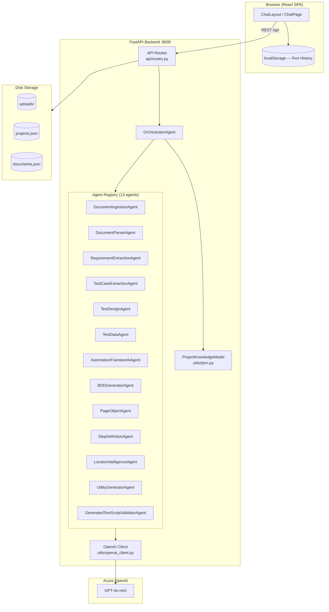
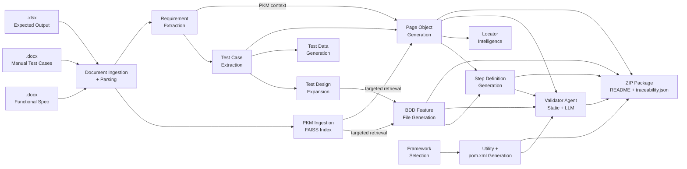
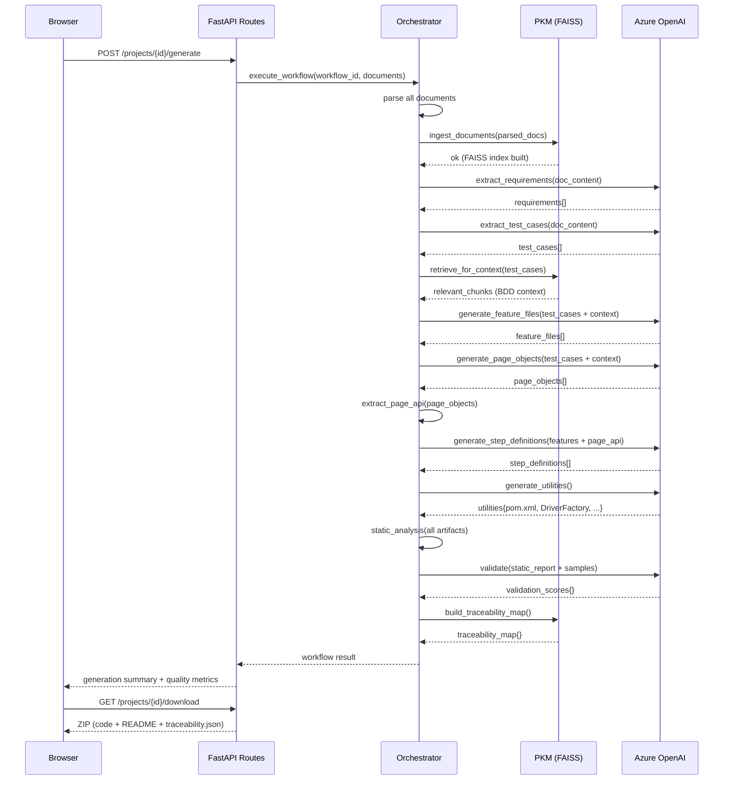
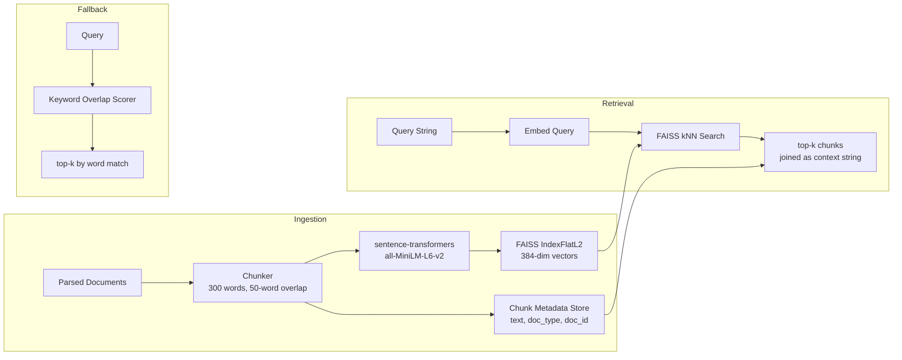
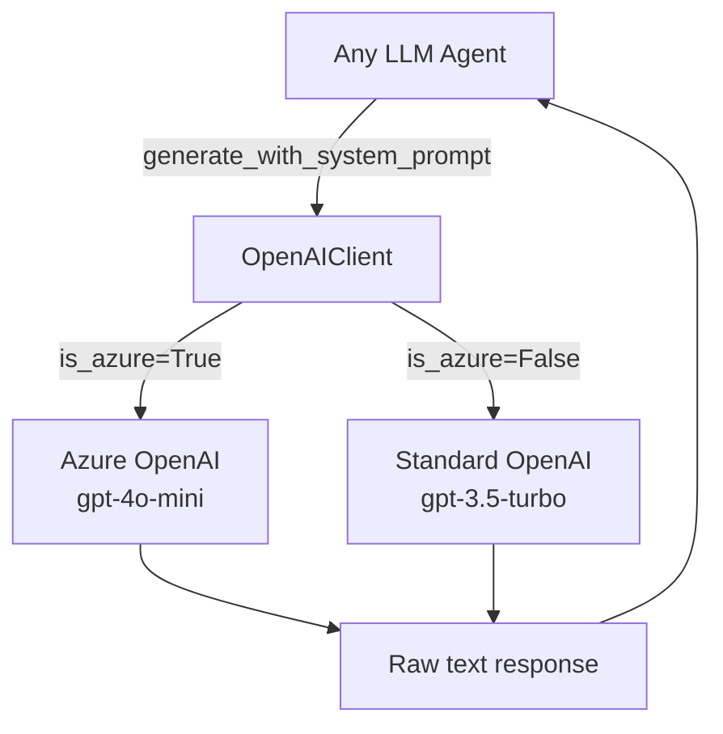
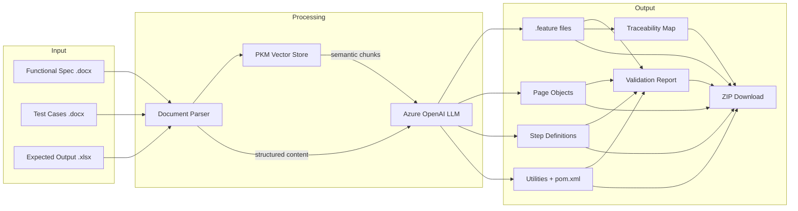

# QA Agent v2 — Architecture Documentation

> Last updated: July 2026  
> A new developer should be able to understand the entire project from this document alone.

---

## Table of Contents

1. [System Overview](#1-system-overview)
2. [High-Level Component Diagram](#2-high-level-component-diagram)
3. [End-to-End Pipeline Flow](#3-end-to-end-pipeline-flow)
4. [Sequence Diagram](#4-sequence-diagram)
5. [Folder Structure](#5-folder-structure)
6. [Agent Responsibilities](#6-agent-responsibilities)
7. [Project Knowledge Model (PKM)](#7-project-knowledge-model-pkm)
8. [LLM Interaction Flow](#8-llm-interaction-flow)
9. [Document Ingestion Flow](#9-document-ingestion-flow)
10. [Generation Pipeline](#10-generation-pipeline)
11. [Validation Pipeline](#11-validation-pipeline)
12. [Packaging Pipeline](#12-packaging-pipeline)
13. [Generated Artifact Descriptions](#13-generated-artifact-descriptions)
14. [Data Flow Diagram](#14-data-flow-diagram)
15. [Adding a New Agent](#15-adding-a-new-agent)
16. [Current Limitations](#16-current-limitations)
17. [Future Improvements](#17-future-improvements)

---

## 1. System Overview

QA Agent v2 is a web-based AI automation platform that converts human-readable QA documents (functional specifications, manual test cases, expected outputs) into a **production-ready Java Selenium + Cucumber BDD automation project**.

### Technology Stack

| Layer | Technology |
|---|---|
| Frontend | React 18, Vite, TailwindCSS, Lucide Icons |
| Backend | Python 3.12, FastAPI, Uvicorn |
| LLM | Azure OpenAI GPT-4o-mini (or standard OpenAI fallback) |
| Embeddings | `sentence-transformers` — `all-MiniLM-L6-v2` |
| Vector Store | FAISS (local, in-memory) |
| Document Parsing | `python-docx`, `pandas` + `openpyxl`, plain text |
| Generated Output | Java 11 + Selenium 4 + Cucumber 7 + Maven |
| Storage | In-memory (projects/documents) + disk persistence via JSON |

### What It Does NOT Do
- It does **not** execute tests — it only generates automation code.
- It does **not** use a database (runs fully in-memory with file-based persistence).
- It does **not** store uploaded files beyond the generation session.

---

## 2. High-Level Component Diagram



---

## 3. End-to-End Pipeline Flow



---

## 4. Sequence Diagram



---

## 5. Folder Structure

```
QA-Agent-v2/
├── backend/                        # FastAPI Python backend
│   ├── main.py                     # App entrypoint — registers all agents
│   ├── config.py                   # Pydantic Settings from .env
│   ├── pyproject.toml              # Backend Python dependencies
│   ├── api/
│   │   └── routes.py               # All REST endpoints
│   ├── agents/                     # One file per agent
│   │   ├── base_agent.py           # Abstract base class for all agents
│   │   ├── document_ingestion_agent.py
│   │   ├── document_parser_agent.py
│   │   ├── requirement_extraction_agent.py
│   │   ├── test_case_extraction_agent.py
│   │   ├── test_design_agent.py
│   │   ├── test_data_agent.py
│   │   ├── automation_framework_agent.py
│   │   ├── bdd_generator_agent.py
│   │   ├── page_object_agent.py
│   │   ├── step_definition_agent.py
│   │   ├── locator_intelligence_agent.py
│   │   ├── utility_generator_agent.py
│   │   └── generated_test_script_validator_agent.py  ← NEW
│   ├── orchestrator/
│   │   └── orchestrator_agent.py   # Coordinates the pipeline
│   ├── parsers/
│   │   └── document_parser.py      # docx / xlsx / txt parsing
│   └── utils/
│       ├── openai_client.py        # Azure OpenAI wrapper
│       └── pkm.py                  # PKM — embeddings + FAISS  ← NEW
│
├── frontend/                       # React SPA
│   ├── src/
│   │   ├── pages/
│   │   │   └── ChatPage.jsx        # Top-level state (run history, generation)
│   │   └── components/
│   │       └── ChatLayout.jsx      # Left sidebar + right panel + modals
│   └── package.json
│
├── sampledata/                     # Sample input files for testing  ← NEW
│   ├── functional_specification.docx
│   ├── manual_test_cases.docx
│   └── expected_output.xlsx
│
├── data/                           # Legacy sample data (txt format)
├── pyproject.toml                  # Root-level dependency manifest
├── README.md
└── ARCHITECTURE.md                 # This file
```

---

## 6. Agent Responsibilities

| Agent | Type | Input | Output | LLM? |
|---|---|---|---|---|
| `DocumentIngestionAgent` | Deterministic | file_path, document_type | Validated metadata | No |
| `DocumentParserAgent` | Deterministic | file_path | Parsed content dict (paragraphs, tables, content) | No |
| `RequirementExtractionAgent` | LLM | Parsed document content | `requirements[]` with id, feature, description | Yes |
| `TestCaseExtractionAgent` | LLM + fallback | Parsed content | `test_cases[]` with id, scenario, steps, expected | Yes |
| `TestDesignAgent` | Deterministic | test_cases | Expanded test cases (positive/negative/boundary) | No |
| `TestDataAgent` | Deterministic | test_cases | Test data sets (valid/invalid/boundary) | No |
| `AutomationFrameworkAgent` | Deterministic | preferred_framework | Framework config dict | No |
| `BDDGeneratorAgent` | LLM | test_cases + PKM context + expected output | `.feature` files (Gherkin) | Yes |
| `PageObjectAgent` | LLM | test_cases + PKM context | Java Page Object classes | Yes |
| `StepDefinitionAgent` | LLM | feature_files + page object API | Java Step Definition classes | Yes |
| `LocatorIntelligenceAgent` | Deterministic | page_objects (with elements dict) | Locator strategy map | No |
| `UtilityGeneratorAgent` | LLM | framework | pom.xml + Java utils + config files | Yes |
| `GeneratedTestScriptValidatorAgent` | Deterministic + LLM | all artifacts + requirements | Quality scorecard (11 dimensions) | Yes |

### Base Agent Contract (`agents/base_agent.py`)

Every agent:
1. Extends `BaseAgent`
2. Implements `execute(input_data: Dict) -> Dict`
3. Calls `self.validate_input(input_data, required_keys)` before processing
4. Calls `self.log_execution(input, output, status)` on completion
5. Returns a dict with at minimum `{"status": "success" | "failed"}`

---

## 7. Project Knowledge Model (PKM)

The PKM (`backend/utils/pkm.py`) provides semantic search over ingested documents, enabling each generation agent to receive focused, relevant context rather than truncated raw text.

### Architecture



### Key Methods

| Method | Purpose |
|---|---|
| `ingest_documents(parsed_docs)` | Chunk all documents → embed → index in FAISS |
| `retrieve(query, top_k, doc_type_filter)` | Semantic search; returns joined context string |
| `get_context_for_agent(agent_type)` | Pre-defined query per agent type |
| `retrieve_for_context(items, field)` | Builds query from test case / requirement text for targeted retrieval |
| `get_expected_output_context()` | Targets expected output documents specifically |
| `build_traceability_map(requirements, test_cases, feature_files, step_definitions, page_objects)` | Builds REQ → TC → Feature → StepDef → PageObject map |

### Fallback Behaviour
If `sentence-transformers` or `faiss` are not available, the PKM falls back to keyword-overlap scoring — the same interface is maintained, ensuring no pipeline breakage.

---

## 8. LLM Interaction Flow

All LLM calls are routed through `utils/openai_client.py`.



### Prompt Structure (all generation agents)

```
SYSTEM_PROMPT  → Role definition + strict output rules (no markdown, exact format)
USER_PROMPT    → CONTEXT section (PKM chunks + expected output)
               + DATA section (formatted test cases / requirements)
               + INSTRUCTIONS section (what to generate)
               + FORMAT section (=== FILE: name.ext === delimiter)
```

### Token Budget

| Agent | max_tokens |
|---|---|
| BDDGeneratorAgent | 6,000 |
| PageObjectAgent | 6,000 |
| StepDefinitionAgent | 6,000 |
| UtilityGeneratorAgent | 7,000 |
| ValidatorAgent | 1,200 |
| RequirementExtractionAgent | 4,000 |
| TestCaseExtractionAgent | 4,000 |

---

## 9. Document Ingestion Flow

```mermaid
flowchart TD
    U[User uploads file via UI] --> API[POST /api/projects/{id}/documents]
    API --> DIA[DocumentIngestionAgent<br/>validate file type + extension]
    DIA --> DISK[Save to uploads/ directory]
    DISK --> META[Store metadata in documents_store]
    META --> OK[Return document_id to frontend]

    OK -->|On Generate| DPA[DocumentParserAgent]
    DPA -->|.docx| DOCX[python-docx<br/>paragraphs + headings + tables]
    DPA -->|.xlsx| XLSX[pandas + openpyxl<br/>sheets → rows → text]
    DPA -->|.txt| TXT[Plain text → lines]
    DOCX --> PARSED[parsed_content dict]
    XLSX --> PARSED
    TXT --> PARSED
```

**Supported file types:** `.docx`, `.xlsx`, `.xls`, `.txt`, `.csv`, `.pdf` (PDF parsing returns empty content — placeholder)

**Parsed content shape:**
```json
{
  "content": "full text string",
  "paragraphs": ["para 1", "para 2"],
  "headings": ["Heading 1"],
  "tables": [[ ["col1","col2"], ["val1","val2"] ]],
  "lines": ["line 1"]
}
```

---

## 10. Generation Pipeline

The orchestrator executes agents in this order:

```
1.  Parse documents          → DocumentParserAgent (per document)
2.  PKM ingestion            → pkm.ingest_documents()
3.  Extract requirements     → RequirementExtractionAgent  (LLM)
4.  Extract test cases       → TestCaseExtractionAgent     (LLM)
5.  Build PKM contexts       → pkm.retrieve_for_context()  (targeted per agent)
6.  Expand test designs      → TestDesignAgent             (deterministic)
7.  Generate test data       → TestDataAgent               (deterministic)
8.  Select framework         → AutomationFrameworkAgent    (deterministic)
9.  Generate .feature files  → BDDGeneratorAgent           (LLM)
10. Generate page objects    → PageObjectAgent              (LLM)
11. Generate step defs       → StepDefinitionAgent          (LLM — uses PO method sigs)
12. Generate locators        → LocatorIntelligenceAgent     (deterministic)
13. Generate utilities       → UtilityGeneratorAgent        (LLM — pom.xml + Java utils)
14. Validate artifacts       → GeneratedTestScriptValidatorAgent (deterministic + LLM)
15. Build traceability map   → pkm.build_traceability_map()
```

### Context Enrichment per Agent

Each LLM generation agent receives an enriched `document_content` string built by `_build_agent_context()`:

```
[Full combined document text (up to 3000 chars)]

=== KNOWLEDGE BASE CONTEXT (Relevant Retrieved Chunks) ===
[PKM semantic retrieval result — top-k chunks targeted to this agent's query]

=== EXPECTED OUTPUT CONTEXT ===
[Expected assertions, HTTP codes, UI messages from expected_output document]
```

---

## 11. Validation Pipeline

The `GeneratedTestScriptValidatorAgent` runs in two phases:

### Phase 1 — Deterministic Static Analysis
Runs entirely in Python (no LLM, no cost):

| Check | What It Detects |
|---|---|
| `Thread.sleep` count | Anti-pattern in page objects |
| Absolute XPath count | Brittle locators like `/html/body/div[1]/...` |
| `//div` without attribute | Generic, fragile XPath |
| `extends BasePage` count | Verifies inheritance pattern |
| `@smoke` / `@regression` tags | Verifies tagging convention |
| `@req-*` tags | Requirement traceability coverage |
| Duplicate `@Given/@When/@Then` patterns | Step definition conflicts |
| `Assert.` call count | Assertion presence |
| TODO comments | Placeholder code |
| Missing core utilities | DriverFactory, BasePage, Hooks, TestRunner, ConfigReader |

### Phase 2 — LLM Scoring
Static analysis report + code samples are passed to GPT-4o-mini for:
- 11 numeric scores (0–100): overall, gherkin, java, step coverage, PO quality, locator, framework, traceability, assertion, maintainability, automation readiness
- `duplicate_steps[]`
- `missing_components[]`
- `improvement_suggestions[]` (3–5 specific items)
- `critical_issues[]` (blocking problems)
- `summary` (one-sentence assessment)

---

## 12. Packaging Pipeline

`GET /api/projects/{id}/download` builds a ZIP in memory:

```
qa_automation_<id>.zip
├── pom.xml                                    ← Maven project (root)
├── README.md                                  ← Generation report + run instructions
├── summary.json                               ← Metrics + quality scores
├── traceability.json                          ← REQ → TC → Feature → StepDef → PO map
├── test_cases.json                            ← Extracted test cases
├── src/
│   └── test/
│       ├── resources/
│       │   ├── features/
│       │   │   ├── Authentication.feature
│       │   │   └── ShoppingCart.feature
│       │   ├── config.properties
│       │   └── cucumber.properties
│       └── java/
│           ├── config/
│           │   ├── DriverFactory.java
│           │   └── ConfigReader.java
│           ├── pages/
│           │   ├── BasePage.java
│           │   ├── LoginPage.java
│           │   └── ...
│           ├── stepdefinitions/
│           │   ├── AuthenticationSteps.java
│           │   └── ...
│           ├── hooks/
│           │   └── Hooks.java
│           ├── runners/
│           │   └── TestRunner.java
│           └── utils/
│               ├── WaitUtils.java
│               └── ScreenshotUtils.java
```

---

## 13. Generated Artifact Descriptions

| File | Package | Purpose |
|---|---|---|
| `*.feature` | `src/test/resources/features/` | Gherkin scenarios — BDD test specifications |
| `BasePage.java` | `pages` | Shared WebDriver + wait utilities for all page objects |
| `*Page.java` | `pages` | Page Object Model — UI element locators + action methods |
| `*Steps.java` | `stepdefinitions` | Cucumber step implementations — call page objects, assert outcomes |
| `DriverFactory.java` | `config` | ThreadLocal WebDriver lifecycle — open/close browser per thread |
| `ConfigReader.java` | `config` | Load `config.properties` from classpath |
| `Hooks.java` | `hooks` | `@Before` start browser, `@After` screenshot on failure + quit |
| `TestRunner.java` | `runners` | JUnit `@RunWith(Cucumber.class)` entry point with `@CucumberOptions` |
| `WaitUtils.java` | `utils` | Static explicit wait helpers |
| `ScreenshotUtils.java` | `utils` | `TakesScreenshot` — save PNG to `target/screenshots/` |
| `pom.xml` | root | Maven build file with all dependency versions |
| `config.properties` | `src/test/resources/` | Runtime configuration (URL, browser, timeouts) |
| `cucumber.properties` | `src/test/resources/` | Cucumber 7.x runner settings |

---

## 14. Data Flow Diagram



---

## 15. Adding a New Agent

### Step 1 — Create the agent file

```python
# backend/agents/my_new_agent.py
from .base_agent import BaseAgent
from typing import Dict, Any

class MyNewAgent(BaseAgent):
    def __init__(self):
        super().__init__("MyNewAgent")

    def execute(self, input_data: Dict[str, Any]) -> Dict[str, Any]:
        if not self.validate_input(input_data, ['required_key']):
            raise ValueError("Missing required input fields")

        result = self._do_work(input_data)

        output_data = {"result": result, "status": "success"}
        self.log_execution(input_data, output_data, status="success")
        return output_data

    def _do_work(self, input_data: Dict[str, Any]) -> Any:
        ...
```

### Step 2 — Register in `main.py`

```python
from agents.my_new_agent import MyNewAgent

my_new_agent = MyNewAgent()
orchestrator.register_agent("MyNewAgent", my_new_agent)
```

### Step 3 — Call from `orchestrator_agent.py`

```python
def _execute_my_step(self, workflow_id: str, ...):
    agent = self.agent_registry.get("MyNewAgent")
    if agent:
        result = agent.execute({...})
        self._log_step(workflow_id, "MyStep", "success", result)
        return result
    return {}
```

### Step 4 — Add to `execute_workflow`

Insert the call in the appropriate pipeline position in `execute_workflow()` and include the result in the returned workflow output dict.

---

## 16. Current Limitations

| Area | Limitation |
|---|---|
| **LLM context** | Document content is truncated to ~4000 chars per agent call; very large specs may lose detail |
| **Concurrency** | FAISS index and `projects_store` are in-memory — not safe for multi-process deployment |
| **PDF support** | `.pdf` files are accepted but content extraction returns empty (placeholder) |
| **Parallel execution** | `DriverFactory` uses `ThreadLocal` but `TestRunner` is single-threaded by default |
| **Framework variety** | Only Java + Selenium + Cucumber BDD is generated; Python/Playwright not yet supported |
| **Locator inference** | `LocatorIntelligenceAgent` only processes elements passed via `elements` dict; LLM-generated locators are inferred from element names |
| **Persistence** | `projects_store` survives restarts via JSON but FAISS index is rebuilt per generation run |
| **Authentication** | No user authentication — single-tenant demo mode |

---

## 17. Future Improvements

| Priority | Improvement |
|---|---|
| High | Replace in-memory store with PostgreSQL for multi-user support |
| High | Add streaming WebSocket progress updates during long generation runs |
| High | Support Python + Playwright framework as an alternative generation target |
| High | PDF content extraction via `pdfminer` or `pymupdf` |
| Medium | Persist FAISS index to disk per project for re-use across sessions |
| Medium | CI/CD pipeline YAML generation (GitHub Actions, GitLab CI) |
| Medium | Configurable output package name / base URL in the UI |
| Medium | Re-generation of individual artifacts (regenerate only step defs, not whole project) |
| Medium | Feedback loop — user can mark quality issues and regenerate with corrections |
| Low | Multi-language support (TypeScript + WebdriverIO, C# + SpecFlow) |
| Low | Visual locator recorder browser extension integration |
| Low | Test execution result ingestion and flaky test detection |

## Core Principles

1. **Single Responsibility**: Each agent has one specific responsibility
2. **Orchestrated Communication**: All inter-agent communication flows through the Orchestrator
3. **Stateless Agents**: Agents don't maintain state between executions
4. **Structured Data Exchange**: All data exchanged uses Pydantic models
5. **Persistent Storage**: State is stored in PostgreSQL and Redis
6. **Traceability**: Every artifact maintains lineage to source requirements

## Agent Architecture

### Agent Hierarchy

```
Orchestrator Agent (Central Coordinator)
├── Document Ingestion Agent
├── Document Parser Agent
├── Requirement Extraction Agent
├── Test Case Extraction Agent
├── Test Design Agent
├── Test Data Agent
├── Automation Framework Agent
├── BDD Generator Agent
├── Page Object Agent
├── Step Definition Agent
├── Locator Intelligence Agent
├── Utility Generator Agent
├── Code Review Agent
├── Execution Agent
├── Reporting Agent
└── Self-Healing Agent
```

### Agent Responsibilities

#### Document Ingestion Agent
- Validates uploaded files
- Stores documents in designated directories
- Generates document IDs
- Performs initial file type validation

#### Document Parser Agent
- Extracts structured data from DOCX files
- Parses Excel spreadsheets
- Identifies sections, tables, headings, paragraphs
- Outputs normalized JSON structure

#### Requirement Extraction Agent
- Identifies business requirements from documents
- Extracts features, business rules, workflows
- Identifies validations and preconditions
- Creates requirement traceability

#### Test Case Extraction Agent
- Parses manual test cases from documents
- Extracts test IDs, scenarios, steps, expected results
- Identifies test data and priority levels
- Maps tests to modules/features

#### Test Design Agent
- Generates positive test scenarios
- Creates negative test cases
- Designs boundary value tests
- Generates equivalence partitions
- Creates smoke, sanity, and regression test suites

#### Test Data Agent
- Generates valid test data
- Creates invalid data for negative testing
- Produces boundary value data
- Generates null/empty data sets
- Creates security testing payloads (SQL injection, XSS, etc.)

#### Automation Framework Agent
- Selects appropriate automation framework
- Configures framework-specific settings
- Manages framework dependencies
- Supports Java Selenium and Python Selenium

#### BDD Generator Agent
- Creates Gherkin feature files
- Generates scenarios from test cases
- Produces Given-When-Then steps
- Maintains feature file structure

#### Page Object Agent
- Generates reusable page classes
- Identifies page elements
- Creates page-specific methods
- Ensures page object patterns

#### Step Definition Agent
- Implements step definitions from Gherkin steps
- Maps steps to page objects
- Generates assertion logic
- Creates reusable step implementations

#### Locator Intelligence Agent
- Analyzes UI elements
- Selects optimal locator strategies
- Priority: ID > Name > CSS > XPath > Relative XPath
- Generates fallback locators

#### Utility Generator Agent
- Creates driver management utilities
- Generates configuration managers
- Produces logging utilities
- Creates screenshot and reporting utilities
- Generates Excel/JSON readers
- Creates retry and wait utilities

#### Code Review Agent
- Validates naming standards
- Checks SOLID principles compliance
- Identifies code smells
- Detects duplicate logic
- Ensures reusability

#### Execution Agent
- Runs test suites
- Manages browser instances
- Captures screenshots and logs
- Records execution metrics
- Handles parallel execution

#### Reporting Agent
- Generates HTML reports
- Creates JSON reports
- Produces execution summaries
- Calculates statistics
- Tracks pass/fail rates

#### Self-Healing Agent
- Detects broken locators
- Suggests locator updates
- Adjusts timeouts
- Implements retry logic
- Never modifies business logic

### Orchestrator Agent

The Orchestrator Agent is the central coordinator that:
- Manages workflow execution
- Sequences agent execution
- Handles dependencies between agents
- Manages state and context
- Implements retry logic
- Logs all agent activities
- Tracks workflow progress

## Data Flow

### Workflow Execution Flow

```
User Upload
    ↓
Document Ingestion Agent
    ↓
Document Parser Agent
    ├→ Requirement Extraction Agent
    └→ Test Case Extraction Agent
        ↓
    Orchestrator (Coordination Point)
        ├→ Test Design Agent
        ├→ Test Data Agent
        ├→ Automation Framework Agent
        │   ├→ BDD Generator Agent
        │   ├→ Page Object Agent
        │   ├→ Step Definition Agent
        │   ├→ Locator Intelligence Agent
        │   └→ Utility Generator Agent
        ├→ Code Review Agent
        ├→ Build & Validation
        ├→ Execution Agent
        ├→ Reporting Agent
        └→ Self-Healing Agent
            ↓
        Final Deliverables
```

## Data Models

### Core Entities

**Project**
- project_id (UUID)
- project_name (String)
- description (Text)
- status (Enum: draft, automation_generated, executed)
- automation_framework (String)
- created_at, updated_at (DateTime)

**Document**
- document_id (UUID)
- project_id (FK)
- document_type (Enum: functional_spec, test_cases, expected_output)
- filename (String)
- file_path (String)
- parsed_content (JSON)

**Requirement**
- requirement_id (UUID)
- project_id (FK)
- feature (String)
- business_rules (JSON Array)
- workflows (JSON Array)
- validations (JSON Array)
- preconditions (JSON Array)
- dependencies (JSON Array)

**TestCase**
- test_id (UUID)
- project_id (FK)
- scenario (String)
- preconditions (JSON Array)
- steps (JSON Array)
- expected_results (JSON Array)
- test_data (JSON Object)
- priority (Enum: low, medium, high)
- module (String)

**AutomationModel**
- model_id (UUID)
- project_id (FK)
- requirements (JSON Array)
- test_cases (JSON Array)
- locators (JSON Object)
- pages (JSON Array)
- assertions (JSON Array)
- business_rules (JSON Array)
- generated_scripts (JSON Array)
- metadata (JSON Object)

## Technology Stack

### Backend
- **Framework**: FastAPI
- **Language**: Python 3.12+
- **ORM**: SQLAlchemy
- **Database**: PostgreSQL
- **Cache**: Redis
- **Agent Orchestration**: LangGraph
- **LLM Integration**: LangChain
- **Logging**: Loguru

### Frontend
- **Framework**: React 18
- **Language**: TypeScript/JavaScript
- **Styling**: Tailwind CSS
- **Build Tool**: Vite
- **HTTP Client**: Axios

### Deployment
- **Containerization**: Docker
- **Orchestration**: Docker Compose (dev), Kubernetes (prod)
- **CI/CD**: GitHub Actions
- **Storage**: Local filesystem (dev), Cloud Storage (prod)

## API Architecture

### RESTful Endpoints

**Projects**
- `POST /api/projects` - Create project
- `GET /api/projects/{id}` - Get project
- `GET /api/projects` - List projects
- `PUT /api/projects/{id}` - Update project
- `DELETE /api/projects/{id}` - Delete project

**Documents**
- `POST /api/projects/{id}/upload` - Upload document
- `GET /api/projects/{id}/documents` - List documents
- `DELETE /api/documents/{id}` - Delete document

**Automation**
- `POST /api/projects/{id}/generate` - Generate automation
- `GET /api/projects/{id}/status` - Get generation status
- `GET /api/projects/{id}/artifacts` - Download artifacts

**Execution**
- `POST /api/projects/{id}/execute` - Execute tests
- `GET /api/projects/{id}/results` - Get execution results

**Health**
- `GET /api/health` - Health check

## Database Schema

### Tables
- projects
- uploaded_documents
- parsed_requirements
- manual_test_cases
- automation_models
- generated_scripts
- execution_results
- agent_logs
- prompt_versions
- build_history

## Deployment Architecture

### Development
```
Docker Compose
├── PostgreSQL (Database)
├── Redis (Cache)
├── FastAPI Backend
└── React Frontend
```

### Production
```
Kubernetes Cluster
├── PostgreSQL StatefulSet
├── Redis Cache
├── FastAPI Deployment (replicas)
├── React Frontend (CDN)
├── Ingress Controller
└── Monitoring Stack
```

## Security Considerations

1. **Authentication**: JWT tokens for API access
2. **Authorization**: Role-based access control
3. **Data Validation**: Pydantic models for all inputs
4. **SQL Injection Prevention**: SQLAlchemy ORM
5. **CORS**: Configured for frontend domain
6. **Environment Variables**: Sensitive data in .env files
7. **Logging**: Sensitive data masked in logs

## Performance Optimization

1. **Caching**: Redis for frequently accessed data
2. **Database Indexing**: Indexes on project_id, document_id
3. **Async Operations**: FastAPI async endpoints
4. **Parallel Execution**: Support for parallel test execution
5. **Connection Pooling**: SQLAlchemy connection pooling

## Monitoring & Observability

1. **Logging**: Structured logging with Loguru
2. **Metrics**: Prometheus metrics (optional)
3. **Tracing**: Distributed tracing (optional)
4. **Dashboards**: Grafana integration (optional)
5. **Alerts**: Alert configuration (optional)

## Scalability

1. **Horizontal Scaling**: Multiple backend instances
2. **Load Balancing**: Nginx/HAProxy
3. **Database Scaling**: Read replicas for PostgreSQL
4. **Caching Layer**: Redis cluster
5. **Message Queue**: RabbitMQ for async tasks (future)

## Error Handling

1. **Agent Failures**: Retry logic with exponential backoff
2. **Validation Errors**: Pydantic validation with detailed messages
3. **Database Errors**: Transaction rollback and logging
4. **API Errors**: Standard HTTP status codes
5. **Logging**: Comprehensive error logging

## Future Enhancements

1. **Prompt Management Agent**: Dynamic prompt versioning
2. **Validation Agent**: Comprehensive validation framework
3. **RAG Knowledge Base**: Retrieval-augmented generation
4. **Human Approval Workflow**: Manual review gates
5. **Configuration Manager**: Dynamic configuration
6. **Playwright Support**: Modern browser automation
7. **Mobile Testing**: Mobile app automation
8. **API Testing**: REST/GraphQL API testing
9. **Performance Testing**: Load and stress testing
10. **Advanced Analytics**: ML-based insights
